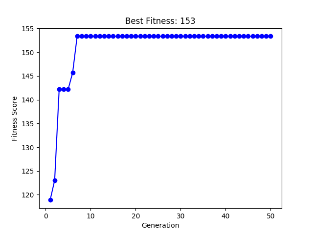

# Seating Arrangement

Given a seating layout and a happiness matrix which defines the happiness value between every pair of persons, it aims to give an optimal seating permutation of persons which maximises the overall happiness factor of the arrangment. It uses Genetic Algorithm to do so.

## To-do
```
1. Add feature for user defined seating layout (instead of a rectangular layout).
2. Randomise input for large data sets (currently hard-coded).
```

## Sample Input Working

Best seating arrangement after 50 generations:<br/>
6 5 1<br/>
7 5 4<br/>
8 9 3<br/>
With happiness score: 153.3606789250354


